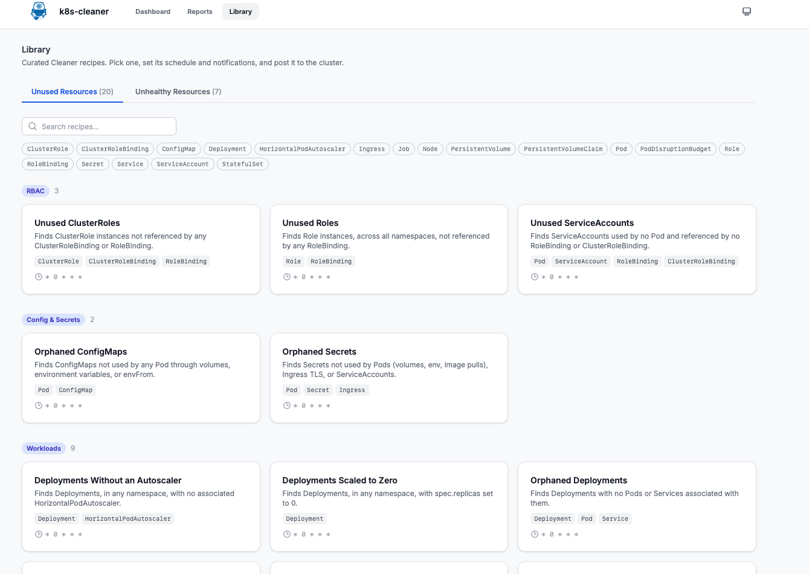
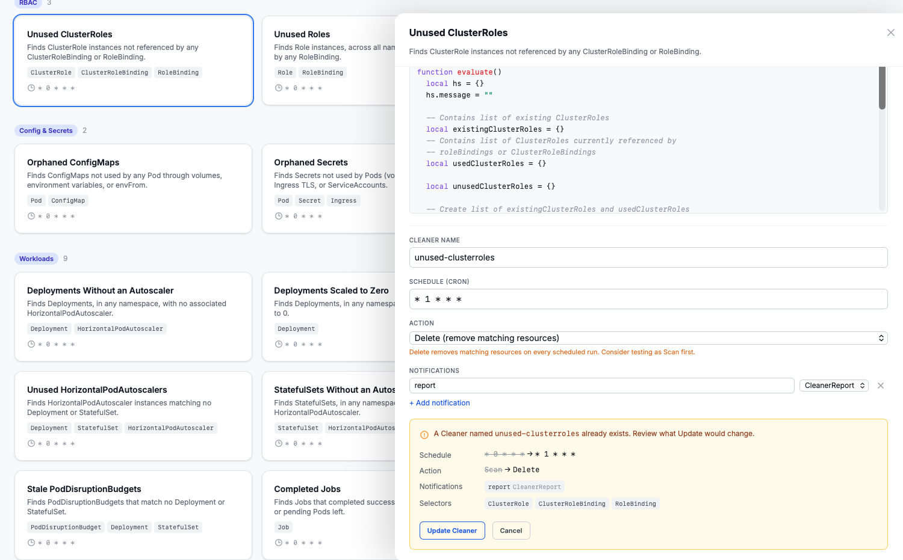
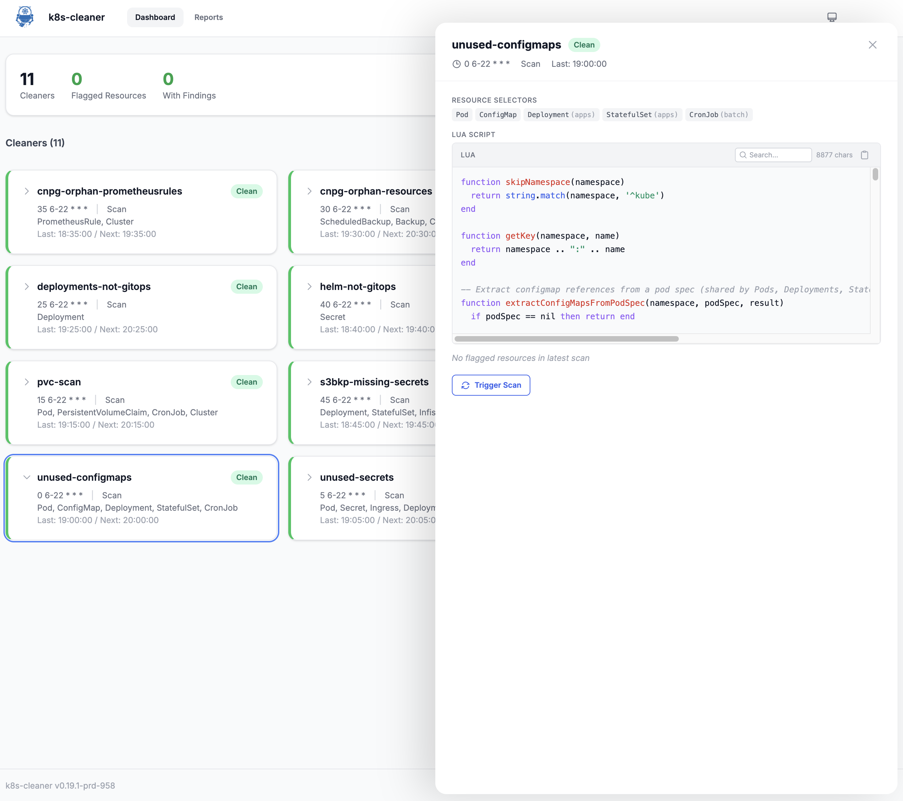
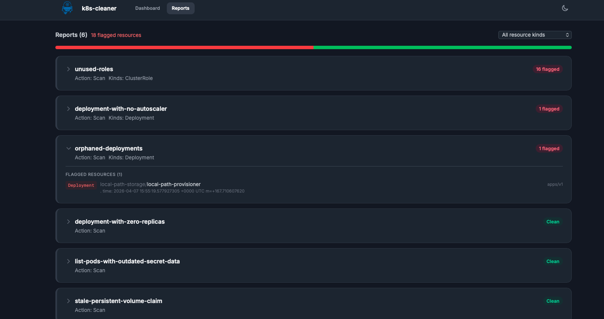

## What is k8s-cleaner?

The Kubernetes controller Cleaner (k8s-cleaner) **identifies**, **removes**, or **updates** stale/orphaned or unhealthy resources to maintain a **clean** and **efficient** Kubernetes cluster.

It is designed to handle any Kubernetes resource types (including custom Kubernetes resources) and provides sophisticated filtering capabilities, including label-based selection and custom Lua-based criteria.

## Pre-requisites
To work with the k8s-cleaner, ensure you have the below points covered.

1. A Kubernetes cluster
1. [kubectl CLI](https://kubernetes.io/releases/download/) installed
1. [kubeconfig](https://kubernetes.io/docs/concepts/configuration/organize-cluster-access-kubeconfig/) for authentication

## Installation

### Kubernetes Manifest

The k8s-cleaner can be installed in any Kubernetes cluster independent if it is in an on-prem or in a Cloud environment. The k8s-cleaner can be deployed down the clusters with your favourite Continious Deployment tool! The installation is pretty simple.

!!! example ""
    ```bash
    $ export KUBECONFIG=<directory to the kubeconfig file>

    $ kubectl apply -f https://raw.githubusercontent.com/gianlucam76/k8s-cleaner/v0.22.0/manifest/manifest.yaml
    ```

!!! note
    The above command will create a new namespace with the name `projectsveltos` and install the Kubernetes cleaner controller there.

### Helm Chart

There is the option to install the k8s-cleaner with a Helm chart. To do so, simply follow the commands listed below.

!!! example ""
    ```bash
    $ helm install k8s-cleaner oci://ghcr.io/gianlucam76/charts/k8s-cleaner \
        --version 0.22.0 \
        --namespace k8s-cleaner \
        --create-namespace #(1)
    ```

    1. It will create the namespace k8s-cleaner and deploy everything in the namespace

#### Validation

```bash
$ kubectl get namespace
NAME              STATUS   AGE
default           Active   6h11m
k8s-cleaner       Active   34s
kube-node-lease   Active   6h11m
kube-public       Active   6h11m
kube-system       Active   6h11m

$ kubectl get all -n k8s-cleaner
NAME                               READY   STATUS    RESTARTS   AGE
pod/k8s-cleaner-78b9d794c5-jpp76   2/2     Running   0          43s

NAME                          TYPE        CLUSTER-IP      EXTERNAL-IP   PORT(S)    AGE
service/k8s-cleaner-metrics   ClusterIP   10.43.149.237   <none>        8081/TCP   43s

NAME                          READY   UP-TO-DATE   AVAILABLE   AGE
deployment.apps/k8s-cleaner   1/1     1            1           43s

NAME                                     DESIRED   CURRENT   READY   AGE
replicaset.apps/k8s-cleaner-78b9d794c5   1         1         1       43s
```

!!! tip
    Before getting started with the k8s-cleaner, have a look at the **Features** section. Familiarise with the [label filters](../features/label_filters/label_filters.md), [store resource](../features/store_resources/store_resource_yaml.md), [update resources](../features/update_resources/update_resources.md), [resource selector](../features/resourceselector/resourceselector.md), and [schedule](../features/schedule/schedule.md) sections. Use the examples provided and familiarise with the syntax and the capabilities provided


### Web Dashboard

The k8s-cleaner includes an optional **embedded web dashboard** that provides a visual interface to manage your cluster's health. It is a lightweight designed to give you instant visibility into your scan results.

**Key Features**

1. **Visual Summaries**: A masonry card layout sorted by severity to help you prioritize issues.
2. **On-Demand Triggers**: Manually initiate specific cleaners or run a full cluster scan directly from the UI.
3. **Lua Script Viewer**: Browse and search your custom Lua logic with syntax highlighting and a copy-to-clipboard feature.
4. **Report Browser**: Filterable scan reports with status bar charts to track resource improvements over time.
5. **[Rollback](../features/rollback/rollback.md)**: Revert the most recent `Delete` or `Transform` execution for a Cleaner with one click, when it has `rollback` configured.
6. **Library**: Browse a curated set of ready-made Cleaner recipes, grouped by resource type, preview their selectors and Lua before using them, then set a name/schedule/action/notifications and post them straight to the cluster.
7. **Flexible Access**: Supports dark/light modes, responsive mobile layouts, and an optional Read-Only mode for production environments.

**⚠️ Important: Data Requirements**

The dashboard does not "poll" the cluster directly for matches; instead, it visualizes CleanerReport objects. For a Cleaner instance to appear in the dashboard, you must configure it to generate a report via the notifications field.

Without this configuration, the dashboard will remain empty even if the Cleaner is active.

Add the following to your Cleaner custom resources to enable reporting:

```yaml
spec:
  # ... other cleaner settings ...
  notifications:
    - name: report
      type: CleanerReport
```

#### Library

The **Library** tab is a curated set of ready-made Cleaner recipes bundled with k8s-cleaner, split into an *Unused Resources* and an *Unhealthy Resources* tab and grouped into labeled sections (RBAC, Workloads, Networking, Storage, and so on) so related recipes sit together.



Selecting a recipe opens a preview of its resource selectors and Lua script, followed by a small form limited to:

- **Name** – the Cleaner's name, pre-filled from the recipe.
- **Schedule** – cron expression, pre-filled from the recipe.
- **Action** – `Scan` (report only) or `Delete`; always defaults to `Scan` so nothing is removed on first use.
- **Notifications** – pre-filled with a `CleanerReport` notification, so a recipe posted from the Library shows up in the dashboard immediately (see the Data Requirements note above); add, remove, or change these freely.

The resource selectors and Lua script themselves are never editable here - they always come from the reviewed recipe, not from the form - and clicking **Post Cleaner** creates the Cleaner CR in the cluster.

If a Cleaner with that name already exists, posting shows a comparison of the current Cleaner against what the recipe would set, and an **Update Cleaner** action to resync it from the recipe instead of failing outright.



The Library is subject to the same Read-Only mode as the rest of the dashboard: with `web.readOnly` set, recipes can still be browsed and previewed, but posting and updating are disabled.

#### Enabling the Dashboard via Helm

The dashboard is disabled by default. To enable it during installation, set the web.enabled value to true.


