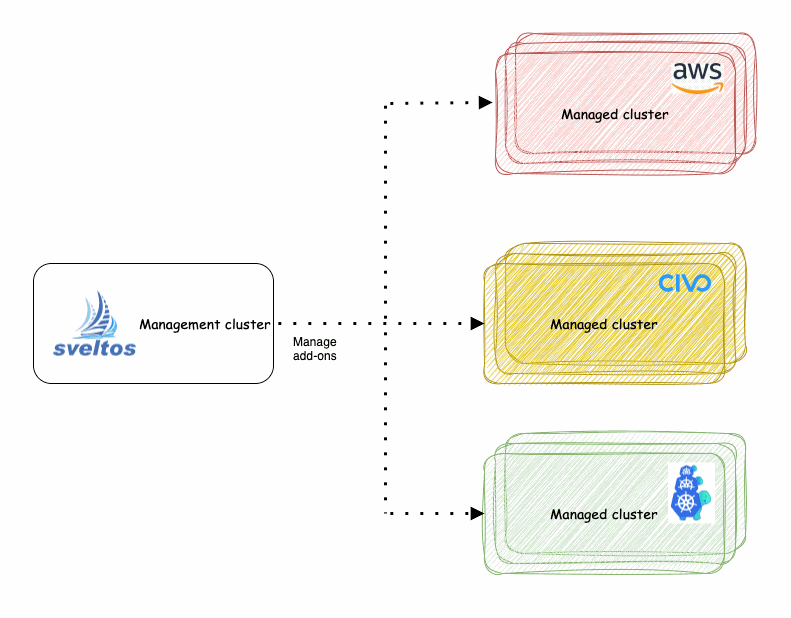

[Sveltos](https://github.com/projectsveltos) is a set of Kubernetes controllers that run in the management cluster. From the management cluster, Sveltos can manage add-ons and applications on a fleet of managed Kubernetes clusters. It is a declarative tool to ensure that the desired state of an application is always reflected in the actual state of the Kubernetes managed clusters.

In a management cluster, each individual Kubernetes cluster is represented by a dedicated resource. Labels can be attached to those resources.

Sveltos configuration utilises a concept called a cluster selector. This selector essentially acts like a filter based on Kubernetes labels. By defining specific labels or combinations of labels, you can create a subset of clusters that share those characteristics.



## Deploying k8s-cleaner across Kubernetes Clusters with Sveltos

By combining k8s-cleaner with Sveltos, you gain a powerful solution for maintaining clean, efficient, and secure Kubernetes clusters across your entire fleet.
This approach simplifies management, reduces operational overhead, and optimizes resource utilization.


### Step 1: Install Sveltos on Management Cluster

For this demonstration, we will install Sveltos in the management cluster. Sveltos installation details can be found [here](https://projectsveltos.github.io/sveltos/getting_started/install/install/).

```
kubectl apply -f https://raw.githubusercontent.com/projectsveltos/sveltos/v0.43.0/manifest/manifest.yaml
kubectl apply -f https://raw.githubusercontent.com/projectsveltos/sveltos/v0.43.0/manifest/default-classifier.yaml
```

### Step 2: Register Civo Cluster with Sveltos

Create two Kubernetes clusters using Civo UI. Download the Kubeconfigs, then:

```
kubectl create ns civo
sveltosctl register cluster --namespace=civo --cluster=cluster1 --kubeconfig=civo-cluster1-kubeconfig --labels=env=fv
sveltosctl register cluster --namespace=civo --cluster=cluster2 --kubeconfig=civo-cluster2-kubeconfig --labels=env=fv
```

Verify your Civo were successfully registered:

```
kubectl get sveltoscluster -n civo
NAME       READY   VERSION
cluster1   true    v1.29.2+k3s1
cluster2   true    v1.28.7+k3s1 
```

### Step 3: Create Deployment Configuration

This guide demonstrates how to deploy k8s-cleaner across all your clusters labeled with `env=fv` using **Sveltos**. 
This helps optimize resource utilization by removing unused configurations and ensuring Pods use the latest secret data.

Applying this configuration will trigger Sveltos to deploy k8s-cleaner to all managed clusters.

```yaml
apiVersion: config.projectsveltos.io/v1beta1
kind: ClusterProfile
metadata:
  name: deploy-k8s-cleaner
spec:
  clusterSelector:
    matchLabels:
      env: fv
  syncMode: Continuous
  helmCharts:
  - repositoryURL:    oci://ghcr.io/gianlucam76/charts
    repositoryName:   k8s-cleaner
    chartName:        k8s-cleaner
    chartVersion:     0.10.0
    releaseName:      k8s-cleaner
    releaseNamespace: k8s-cleaner
    helmChartAction:  Install
```

- _unused-configmaps.yaml_: contains a Cleaner that identifies and removes unused ConfigMaps to optimize resource utilization.
- _pod-with-outdated-secret-data.yaml_: contains a Cleaner instance that detects Pods using outdated Secrets and triggers necessary actions (e.g., restart) to ensure up-to-date data.
- _clusterprofile-deploy-cleaner.yaml_: instructs Sveltos to deploy Cleaner instances across all managed clusters.

```
kubectl apply -f https://raw.githubusercontent.com/projectsveltos/demos/main/k8s-cleaner/unused-configmaps.yaml
kubectl apply -f https://raw.githubusercontent.com/projectsveltos/demos/main/k8s-cleaner/pod-with-outdated-secret-data.yaml
kubectl apply -f https://raw.githubusercontent.com/projectsveltos/demos/main/k8s-cleaner/clusterprofile-deploy-cleaner.yaml
```

Using [sveltosctl](https://github.com/projectsveltos/sveltosctl) we can verify all resources have been deployed.