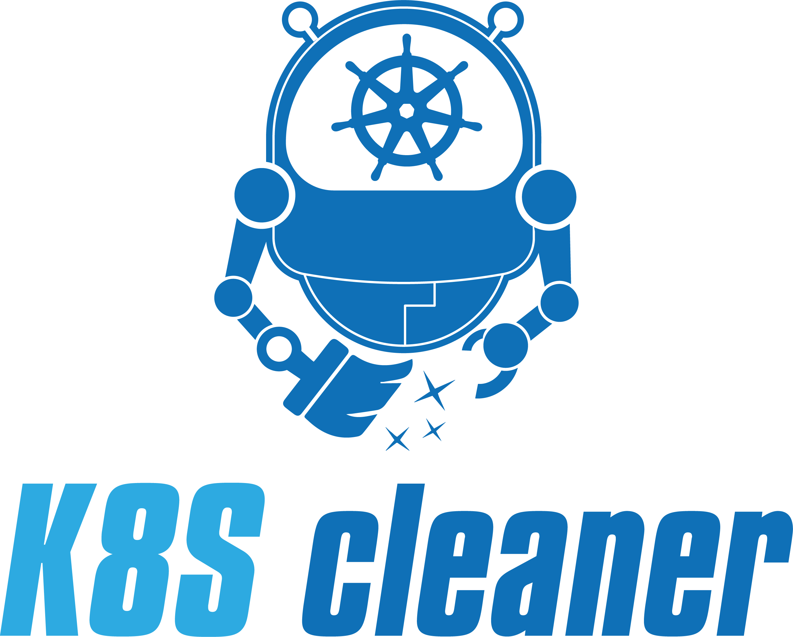

<a class="github-button" href="https://github.com/gianlucam76/k8s-cleaner" data-icon="icon-park:star" target="_blank" data-show-count="true" aria-label="Star k8s-cleaner on GitHub">Star</a>

<h1>Kubernetes Controller Cleaner or k8s-cleaner</h1>

## What is k8s-cleaner?

## Support us

!!! tip ""
    If you like the project, please <a href="https://github.com/gianlucam76/k8s-cleaner" title="k8s-cleaner" target="_blank">give us a</a> <a href="https://github.com/gianlucam76/k8s-cleaner" title="k8s-cleaner" target="_blank" class="heart">:octicons-star-fill-24:</a> if you haven't done so yet. Your support means a lot to us. **Thank you :pray:.**

[:star: k8s-cleaner](https://github.com/gianlucam76/k8s-cleaner "k8s-cleaner"){:target="_blank" .md-button}